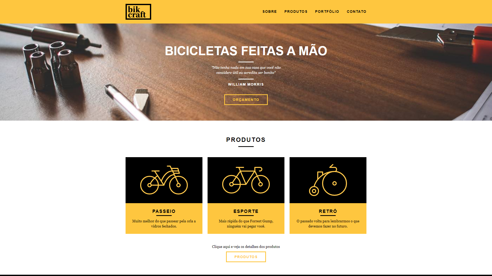

<h1 align="center">Bikcraft</h1>

# O projeto
Projeto desenvolvido durante o curso "Web Design Completo" da Origamid - https://www.origamid.com/curso/web-design-completo - focado em desenvolver um site de bicicletas, responsivo e com diferentes telas.<br/> 

# Tecnologias utilizadas
- HTML
- CSS
- JAVASCRIPT

# Como executar
```bash
- Utilizando o terminal:

  # Clone o repositório: 
  $ git clone https://github.com/HeloiseSantos/site-bikcraft.git

  # Abra o projeto em uma IDE (Preferencialmente no Visual Studio Code para utilizar a extensão abaixo)
  
  # Utilize a extensão Live Server para abrir um server local e visualizar a tela do projeto
  https://marketplace.visualstudio.com/items?itemName=ritwickdey.LiveServer
```

# Layout do projeto
<div align="center">
    
    
    
</div>
